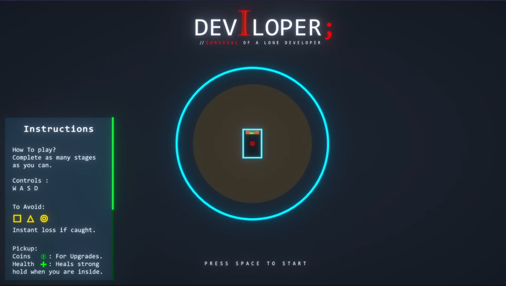
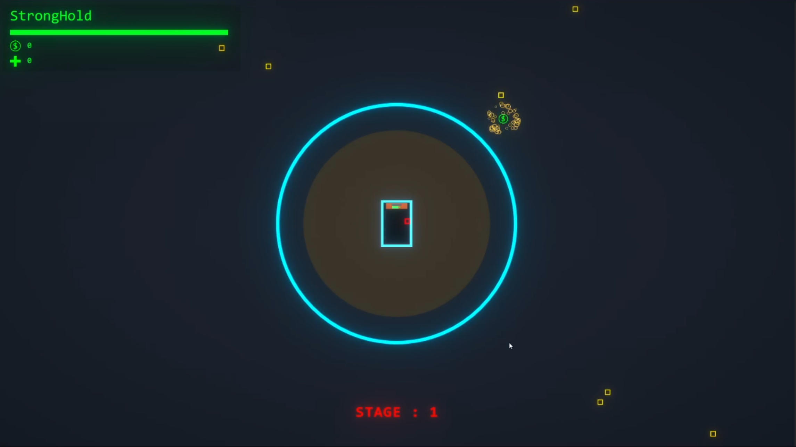
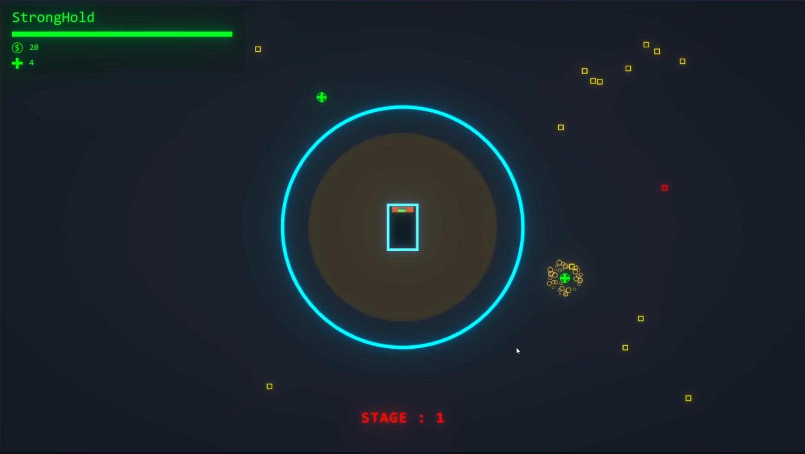
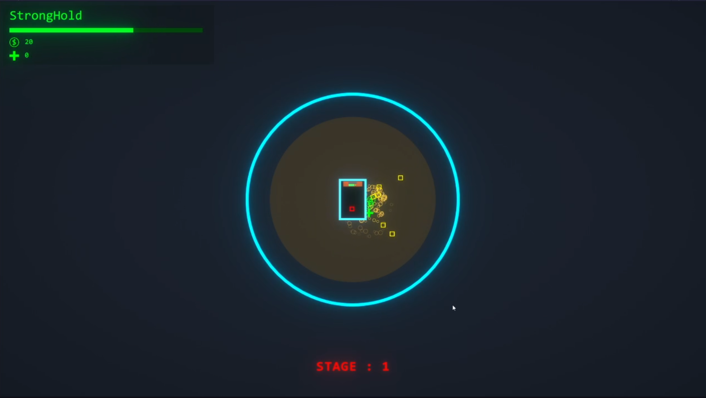
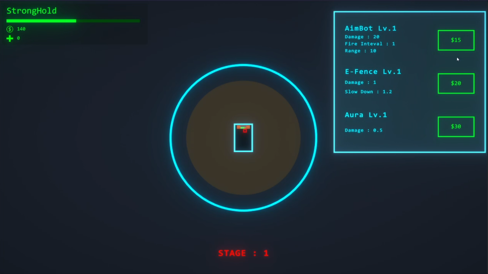
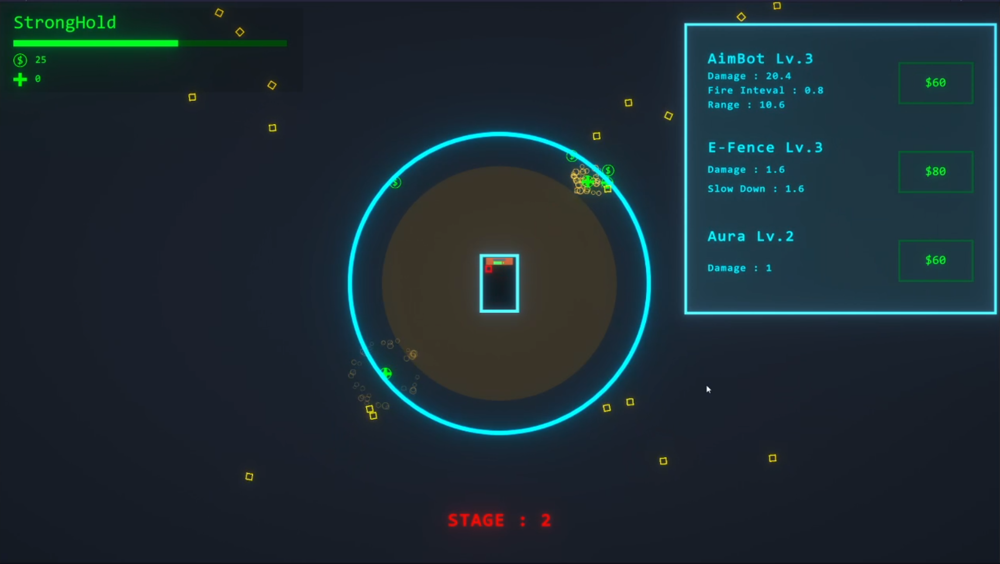
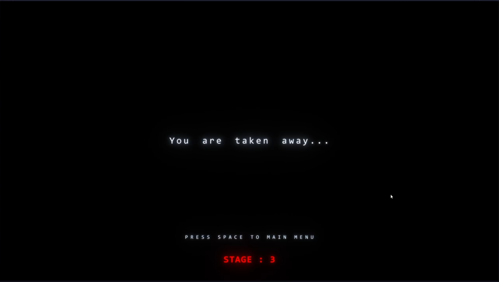

# Deviloper
Survival of a lone developer. Our poor developer is disturbed by the distraction and what better way to deal with them than developing distructive weapons. Help remove all the distractions and dont let them catch you. 

# AIM
In this game, you have to survive the waves of enemies. The game is over if the enemies touch you.
The Game is in stages and each stage spawns a certain amount of enemies. Survive as many stages as you can.

# Features
There are 3 types of enemies:
- normal : mid speed, mid damage
- Fast : high speed, low damage
- Heavy : low speed, high damage

You have 3 abilities:
- AimBot: predict the enemy location and shoots.
- Electric fence: Sloes down enemy.
- Aura: constant damage when in the area.

You have to collect:
- Coins for upgrading your abilities.
- Health for healing stronghold.
Once the stronghold health is Zero. It will no longer protect you.
To upgrade, you need to go near the computer and the upgrade menu will slide in.

# Code Design
- Scaleable stage structure for controlling each state properties
- Object Pooling for bullets and enemies.
- Powerup Upgrade System using observer pattern.

#ScreenShots

